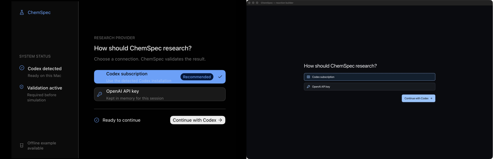

# ChemSpec

ChemSpec is a chemistry exploration app built for the Education category of
[OpenAI Build Week 2026](https://openai.devpost.com/). Learners construct a
reaction question, follow its structural changes atom by atom, and then see a
macroscopic 3D interpretation of the same validated outcome.

**[Try the web demo](https://charles-mills.github.io/ChemSpec/) · [Project documentation](docs/README.md)**

The reviewed catalogue and algorithmic solver handle supported chemistry
locally. When both decline, the desktop app can consult the user's signed-in
Codex installation, then validate the proposal before it is allowed to drive a
simulation.

## What ChemSpec Does

Chemistry equations describe inputs and outputs, but they do not make it easy
to see which atoms persist, which relationships change, or how those changes
relate to visible observations. ChemSpec connects those views in one guided
experience for secondary-school learners, educators, and introductory
chemistry students.

1. **Ask:** construct reactants from the periodic table or enter a recognised
   name or formula.
2. **Resolve:** use a reviewed reaction or derive the outcome with the local
   solver, falling back to Codex only when local methods decline.
3. **Inspect:** follow stable atoms, bonds, ionic associations, electron
   transfers, products, and observations through the structural 2D sequence.
4. **Observe:** continue into an illustrative macroscopic 3D view compiled from
   the same validated reaction.
5. **Explain:** inspect the equation, products, structural derivation, and the
   provenance of model-proposed results.

Unlike a fixed collection of prerecorded animations, ChemSpec lets a learner
pose the question. It still declines chemistry that it cannot represent or
validate instead of turning a plausible model answer into a trusted result.

## Reactions to Try

These examples were checked through the same headless resolution and reaction
path used by the application:

| Reactants | Outcome | Frames |
| --- | --- | ---: |
| `sodium` + `water` | `2Na + 2H2O -> 2NaOH + H2` | 13 |
| `HCl` + `NaOH` | `HCl + NaOH -> NaCl + H2O` | 8 |
| `AgNO3` + `NaCl` | `AgNO3 + NaCl -> AgCl + NaNO3` | 7 |
| `HCl` + `NaHCO3` | `HCl + NaHCO3 -> NaCl + H2O + CO2` | 14 |

## How We Used Codex and GPT-5.6

We built ChemSpec from the ground up using GPT 5.6 Sol ("Sol"). Starting the project, we began with a team-meeting discussing our intended outcome. Once agreed, we handed off to a fresh thread, describing what we wanted to achieve and the components it would require. We requested Sol first ask us everything required to close out any assumptions, after which it was ready to write the [implementation plan](docs/plans/implementation-plan.md) and specifications.

Sol then worked through the stages it had specified, end-to-end.

### Designing with Codex

When designing or redesigning the UI, we relied on the Product Design product within Codex. A typical redesign consisted of handing Sol screenshots of the existing pages, providing our critiques, and describing the ideal outcome. Codex then used that to produce rapid visual mockups, considerably faster than using Iced's compile-and-run cycle for questions of composition, hierarchy, spacing and visual weight.

Once the mockup was approved, Sol would produce native Iced components within the app. Once done, Codex would autonomously launch the app, verify the outcome against the agreed mockup, and iterate further if needed.

The provider setup screen preserves this process in the repository. Its
[visual QA record](docs/archive/qa/provider-setup/README.md) includes the reference design, implementation captures, invalid and valid input states, a
normalized side-by-side comparison, the changes made after inspection, and the
final result. That entire QA process was captured and recorded autonomously by
GPT-5.6 Sol.



### Engineering with Codex

We used repository documents as working contracts for Codex. Larger changes
were divided into bounded tasks in the
[implementation plan](docs/plans/implementation-plan.md), while decisions and
failed assumptions were recorded in the
[rebuild decision log](docs/plans/rebuild-decisions.md). Codex implemented and
reviewed changes across the Rust workspace, ran focused verification while
iterating, and helped us inspect the native application through dedicated
`ChemSpec Agent Smoke` builds.

This workflow is visible in the Git history as well as the documentation:
ChemSpec has Codex-specific branches and commits for UI integration, visual
inspection, sizing fixes, and code review. Packaged smoke checks are recorded
for the reaction builder and representative 3D reactions rather than inferred
from unit tests.

### Codex inside ChemSpec

Codex is also part of the finished application. When the reviewed catalogue
and local reaction solver both decline, ChemSpec can ask the user's signed-in
Codex installation for a narrow, structured reaction claim. If local
graph-difference and reviewed-family mechanisms also decline, Codex may propose
an atom mapping and a bounded sequence of operations over structures supplied
by ChemSpec.

Those proposals are not trusted chemistry. Codex cannot author the structures,
coefficients, valence rules, internal identities, or validated simulation
frames. ChemSpec resolves and balances the reaction locally, then runs any
proposed mechanism through the same deterministic chemistry kernel used for
offline reactions. If it cannot validate the result, it declines to animate
it. The complete boundary is documented in the
[agent workflow](docs/agent-workflow.md).

## How ChemSpec Works

```text
reaction request
  -> reviewed catalogue fast path
  -> algorithmic reaction solver
     -> miss: revalidated cache, then Codex claim
  -> exact balancing and checked declaration
  -> local graph-difference or reviewed-family mechanism
     -> miss: bounded Codex mapping and operation proposal
  -> deterministic chemistry kernel
  -> validated renderer-independent frames
  -> structural 2D and macroscopic 3D presentation
```

The governing rule is simple:

> Codex proposes; ChemSpec validates.

Codex cannot construct a trusted chemistry value, and the application cannot
mark one as valid. The validator and chemistry kernel sit between every local,
cached, or model-proposed result and the simulation. The full crate boundaries
and contracts are documented in the [system architecture](docs/system-architecture.md).

## Running ChemSpec

### Web demo

Open the [ChemSpec web demo](https://charles-mills.github.io/ChemSpec/) in a
browser with WebGPU support. The web build runs in local mode: browser
sandboxes cannot invoke the installed Codex CLI, so catalogue and algorithmic
outcomes remain available while live Codex fallback does not.

### Desktop app

The workspace pins Rust `1.96.1`; `rustup` will select it from
`rust-toolchain.toml`.

```sh
git clone https://github.com/charles-mills/ChemSpec.git
cd ChemSpec
cargo run -p chemspec-app
```

With [`just`](https://github.com/casey/just) installed, the equivalent command
is `just run`. Version tags trigger the release pipeline, which builds a
Windows MSI, a Linux AppImage and standalone binary, and a universal macOS DMG.
These packages are unsigned.

Local chemistry does not require an account or network connection. To use the
dynamic fallback, install the
[Codex CLI](https://github.com/openai/codex), sign in with a ChatGPT account,
and confirm that the session is available:

```sh
codex login
codex login status
```

ChemSpec checks the binary, version, authentication status, and required CLI
capabilities at startup. It does not read Codex credential files.

## Headless Verification

The `react` subcommand runs the same reactant resolution and reaction path as
the GUI without opening a window. It prints the selected outcome as JSON:

```sh
cargo run -p chemspec-app -- react sodium water
cargo run -p chemspec-app -- react HCl NaOH
cargo run -p chemspec-app -- react --verbose sodium water
```

`--verbose` includes the complete renderer-independent frame artifact and its
stable digest. To run the repository's normal CI gate locally:

```sh
cargo fmt --all --check
cargo test --workspace --all-targets
cargo clippy --workspace --all-targets -- -D warnings
```

Meaningful chemistry and simulation behavior is tested without a GPU. Native
startup, packaging, live Codex access, and GPU rendering require their separate
smoke checks; they are not inferred from unit tests. See the complete
[verification strategy](docs/verification.md).

## Trust, Scope, and Safety

- Exact chemistry quantities use rational and decimal representations rather
  than binary floating point.
- Raw or stale model output cannot enter the simulation.
- A model-proposed mechanism must pass the same conservation and structural
  validation as a locally derived one.
- Unsupported, invalid, and provider-failure states remain distinct.
- ChemSpec is an educational explanatory model, not a laboratory procedure,
  kinetics engine, or molecular-dynamics system.

The detailed boundaries are recorded in the [product specification](docs/product-spec.md),
[chemistry engine](docs/chemistry-engine.md), and [safety policy](docs/safety.md).

## Technology

- Rust 2024, pinned to Rust `1.96.1`
- Iced `0.14.0` for the Elm-style desktop and web application
- Iced Canvas and shader primitives for deterministic 2D and 3D presentation
- Exact domain types, a custom `.chems 1` language, and a deterministic
  structural validation kernel
- The local Codex CLI for bounded dynamic reaction claims and mechanism
  proposals

The workspace is divided into domain, language, catalogue, kernel, agent,
presentation, and application crates. See [crates/README.md](crates/README.md)
for the map.

## Team and License

ChemSpec was built by Aryan Saini, Charles Mills, Oliver Robbins, and Patryk for
OpenAI Build Week 2026. See [CONTRIBUTORS.md](CONTRIBUTORS.md) for contributor
details.

ChemSpec is released under the [MIT License](LICENSE).
