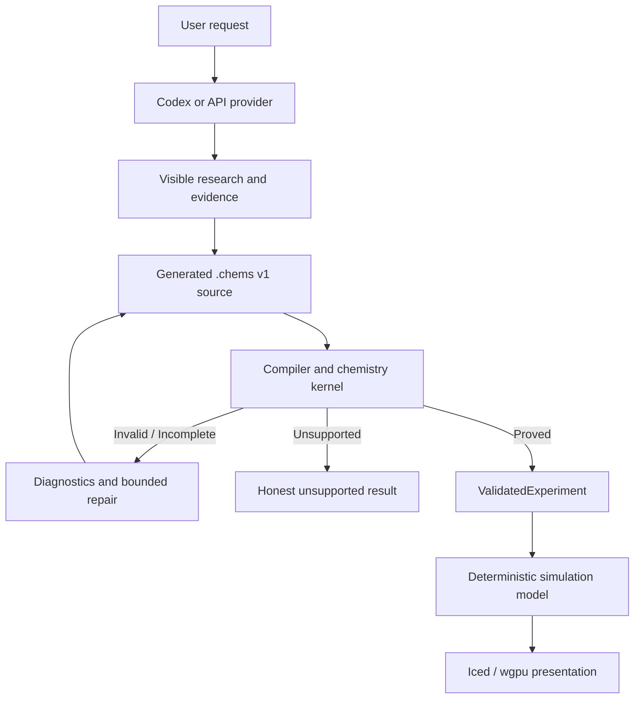

# ChemSpec

ChemSpec is an AI-assisted virtual chemistry laboratory. A learner asks what
happens when substances are mixed; an agent researches the expected reaction,
writes a chemistry-native `.chems` program, and submits it to a deterministic
validator. Only validated experiments can drive the explanatory particle
simulation.

The project is being built for the Education category of
[OpenAI Build Week](https://openai.devpost.com/).



## Product contract

ChemSpec separates proposal, trust, meaning, and presentation:

```text
User request
    -> agent research and cited evidence
    -> generated .chems source
    -> parser and deterministic chemistry validation
    -> validated experiment
    -> explanatory particle simulation
```

- The agent may research and propose chemistry.
- The `.chems` file is visible and editable by humans.
- The validator is the only component that can promote source into a validated
  experiment.
- The simulation visualizes validated chemistry; it does not discover reaction
  outcomes through particle collisions.
- Unsupported chemistry is reported as unsupported, not treated as false.

## Initial chemistry domain

The first complete domain is closed-world aqueous ionic chemistry under
ordinary classroom-laboratory conditions:

- precipitation reactions;
- strong acid/strong base neutralization;
- a small, curated set of gas-forming reactions;
- explicit no-net-reaction outcomes.

The initial domain does not attempt arbitrary materials, organic mechanisms,
general redox, combustion, quantitative kinetics, or molecular dynamics.

## Example

```chems
use catalog ChemSpec.Aqueous@1

experiment SilverChloridePrecipitation where
  conditions
    temperature := 25 degC
    pressure    := 1 atm
    medium      := aqueous

  given
    silverNitrate  := 50 mL of 0.100 M AgNO3(aq)
    sodiumChloride := 50 mL of 0.100 M NaCl(aq)

  mix silverNitrate with sodiumChloride

  expect
    class := precipitation

    molecular :=
      AgNO3(aq) + NaCl(aq)
        -> AgCl(s) + NaNO3(aq)

    completeIonic :=
      Ag^+(aq) + NO3^-(aq) + Na^+(aq) + Cl^-(aq)
        -> AgCl(s) + Na^+(aq) + NO3^-(aq)

    netIonic :=
      Ag^+(aq) + Cl^-(aq)
        -> AgCl(s)

    observe
      precipitate AgCl(s)
      colour white

  by
    dissociate aqueous
    apply solubilityRules
    verify atoms
    verify charge
    solve stoichiometry
```

## Documentation

- [Product specification](docs/product-spec.md)
- [The `.chems` language](docs/chems-language.md)
- [Chemistry engine and validator](docs/chemistry-engine.md)
- [System architecture](docs/system-architecture.md)
- [Agent workflow and providers](docs/agent-workflow.md)
- [Safety policy](docs/safety.md)
- [Verification strategy](docs/verification.md)
- [Build Week delivery plan](docs/delivery-plan.md)
- [Build Week implementation plan](docs/implementation-plan.md)

## Current status

ChemSpec is in the design and initial implementation phase. The documents above
define the agreed product and technical contracts; implementation status should
be tracked separately from those contracts as the workspace is scaffolded.

## License

MIT. See `LICENSE`.
