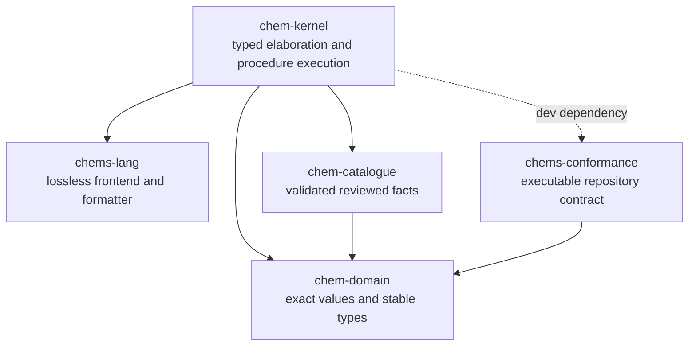

# ChemSpec crates

The workspace is split into five crates so that syntax, exact domain values,
reviewed chemistry facts, trusted execution, and repository conformance remain
separate. Dependency arrows below point from each crate to the workspace crate
it depends on.

| Crate | Responsibility | Key outputs |
| --- | --- | --- |
| [`chem-domain`](chem-domain/) | Pure exact values, chemistry types, stable IDs, and immutable state types | Quantities, formulae, materials, stages, and canonical digests |
| [`chems-lang`](chems-lang/) | Lossless `.chems` lexing, parsing, diagnostics, and canonical formatting | CST, source AST, and formatted source |
| [`chem-catalogue`](chem-catalogue/) | Validation and deterministic indexing of versioned reviewed chemistry data | `ValidatedCatalogue` |
| [`chem-kernel`](chem-kernel/) | Catalogue-backed typed elaboration and deterministic procedure execution | `TypedExperiment`, `StageTimeline`, and classified diagnostics |
| [`chems-conformance`](chems-conformance/) | Validation of the repository's specification, grammar, manifests, and fixtures | `ValidationSummary` and the `chems-conformance` CLI |

The dependency structure keeps `chem-domain` and `chems-lang` usable without
the trust policy or execution engine, while `chem-kernel` is the boundary that
combines parsed source with one validated catalogue.
