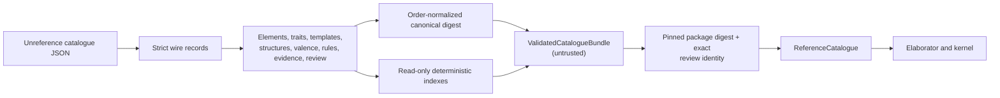

# `chem-catalogue`

`chem-catalogue` owns the immutable, versioned structural identities and
closed reaction rules used by `.chems 1`. Its bundled reference data
contains lithium metal, water, lithium hydroxide, hydrogen, the closed
`Rules.AlkaliMetalWithWater` outcome, Li/H/O electron premises, typed
observation compatibility, evidence, and review attestations.

It does not elaborate `.chems` source or execute structural operations. Those
are the Slice 4 and Slice 5 boundaries respectively.

## Reference-data integrity boundary

`ValidatedCatalogueBundle::from_json` checks external data.
`ReferenceCatalogue::from_canonical_json` additionally verifies the packaged
catalogue digest and its review artifact. That establishes reproducible factual
provenance, not permission: catalogue membership is never an allow-list and
does not authorize simulation. Runtime agents cannot rewrite the packaged
reference identity.

Consumers receive immutable references and can distinguish an unsupported
structure or rule lookup from a corrupt bundle system error.

Structure records distinguish ordinary shared covalent bonds from directed
dative single bonds. Reviewed dative operation templates retain their premise
IDs, require exact donor/acceptor identity, and validate donor-pair formation
or explicit cleavage allocation before they can enter the bundle.

The catalogue digest is insensitive to record ordering where order has no
meaning. The ordered operation template remains digest-significant.

## Generalized-rules G3 boundary

Catalogue schema 1 may optionally carry a reviewed element registry and
element-category definitions. `ValidatedCatalogueBundle` derives deterministic
category membership and premise-backed lookup indexes while preserving the
existing concrete catalogue records and digest compatibility. The migration
registry is not used to resolve existing structures yet.

Schema 1 may also carry reviewed structural-trait definitions, exact checked
trait assertions, parameterized structure templates, and stable template
applications. Element, closed-enum, and trait-constrained structure arguments
are resolved deterministically. Applications are constructed through the same
structural graph and valence checks as concrete records, enter ordinary
structure lookup under their stable IDs and aliases, and retain separate
template, argument, trait, application, and premise provenance.

Schema 1 now also carries premise-backed typed graph patterns. The matcher
enumerates injective atom bindings and exact shared/dative bonds, group and
ionic membership, metallic ownership, and checked trait sites in canonical
order. Multi-role matches are provisional read-only values: they cannot create
an expanded reaction or cross the kernel boundary. Reactant-graph
automorphism comparison is exposed separately so later elaboration can
identify symmetric raw matches without selecting the first atom ID.

Schema 1 now also carries inert generalized reaction families. Their parameter
domains come only from reviewed element categories, checked structural traits,
or closed enums. Validation proves role/selector compatibility, disjoint and
reachable unordered cases, exact supported/unsupported payload shape, total
atom correspondence and product assignment, closed rewrite references, and
complete premise binding. Uncovered finite bindings remain unsupported, and a
selected unsupported case exposes its reviewed feature gap without a rewrite.

G4 deterministically infers family parameters from concrete source roles and
reviewed template applications or checked traits, selects one unordered case,
matches typed graphs independently for every coefficient instance, and
canonicalizes complete instantiated certificates under reactant and product
automorphisms plus repeated-instance permutations. The unique certificate is
instantiated through the existing concrete mapping and operation boundary with
matched-site and premise-local provenance. G5 executes that output through the
unchanged concrete kernel, compares exact member-specific final graphs, and
registers the Li/Na/K family plus its mutation boundaries in conformance. The
migrated family contains no concrete lithium fallback; concrete-only catalogues
remain supported as the compatibility exception.

G6 keeps candidate authoring outside the bundled reference data. The `chems
catalogue check` compiler accepts closed three-file content packages, generates
and validates a working `CatalogueEnvelope`, and emits a pending review request.
Neither that request nor the generated candidate inspection artifacts can call
or configure `ReferenceCatalogue::from_canonical_json`; packaging reviewed
reference data still requires the exact host-pinned digest and a separately
supplied review artifact. Provisional data can nevertheless reach the same
simulation capability after passing the same kernel validation.
