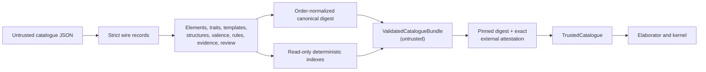

# `chem-catalogue`

`chem-catalogue` owns the immutable, versioned structural identities and
closed reaction rules used by `.chems 1`. Its first review-candidate bundle
contains lithium metal, water, lithium hydroxide, hydrogen, the closed
`Rules.AlkaliMetalWithWater` outcome, Li/H/O electron premises, typed
observation compatibility, evidence, and review attestations.

It does not elaborate `.chems` source or execute structural operations. Those
are the Slice 4 and Slice 5 boundaries respectively.

## Trust boundary

`ValidatedCatalogueBundle::from_json` checks untrusted data but does not grant
trust. Only `TrustedCatalogue::from_canonical_json` can construct the runtime
trust form, and it accepts exactly the host-pinned catalogue digest plus a
separately host-pinned review artifact bound to every premise. Runtime agents
cannot extend either trust root.

Consumers receive immutable references and can distinguish an unsupported
structure or rule lookup from a corrupt bundle system error.

Structure records distinguish ordinary shared covalent bonds from directed
dative single bonds. Reviewed dative operation templates retain their premise
IDs, require exact donor/acceptor identity, and validate donor-pair formation
or explicit cleavage allocation before they can enter the bundle.

The catalogue digest is insensitive to record ordering where order has no
meaning. The ordered operation template remains digest-significant.

## Generalized-rules G2 boundary

Catalogue schema 1 may optionally carry a reviewed element registry and
element-category definitions. `ValidatedCatalogueBundle` derives deterministic
category membership and premise-backed lookup indexes while preserving the
existing concrete catalogue records and digest compatibility. The migration
registry is not used to resolve existing structures yet.

Schema 1 may also carry reviewed structural-trait definitions, exact checked
trait assertions, parameterized structure templates, and stable template
applications. Element, closed-enum, and trait-constrained structure arguments
are resolved deterministically. Applications are constructed through the same
structural graph and valence checks as concrete records, enter ordinary
structure lookup under their stable IDs and aliases, and retain separate
template, argument, trait, application, and premise provenance.

Schema 1 now also carries premise-backed typed graph patterns. The matcher
enumerates injective atom bindings and exact shared/dative bonds, group and
ionic membership, metallic ownership, and checked trait sites in canonical
order. Multi-role matches are provisional read-only values: they cannot create
an expanded reaction or cross the kernel boundary. Reactant-graph
automorphism comparison is exposed separately so later elaboration can
identify symmetric raw matches without selecting the first atom ID.

Generalized reaction families, case selection, rewrite instantiation, product
certificate equivalence, and source elaboration remain unimplemented after
G2.
