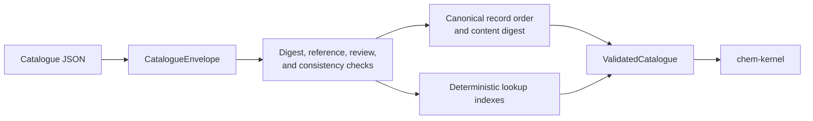

# `chem-catalogue`

> Rebaseline status: Slice 3 will replace the catalogue record model with
> reviewed structures, electron premises, applicability rules, mapping and
> operation templates, and typed observation compatibility.

`chem-catalogue` owns immutable, versioned chemistry facts, evidence records,
condition domains, coverage declarations, deterministic lookup indexes, and
canonical digest validation.

It does not elaborate `.chems` source, infer reactions, execute procedures, or
construct validated experiment artifacts.

## Validation flow

Construction of `ValidatedCatalogue` is private to validation. Consumers can
therefore resolve elements, substances, species, media, facts, assumptions,
coverage declarations, and provenance without handling unchecked records.
