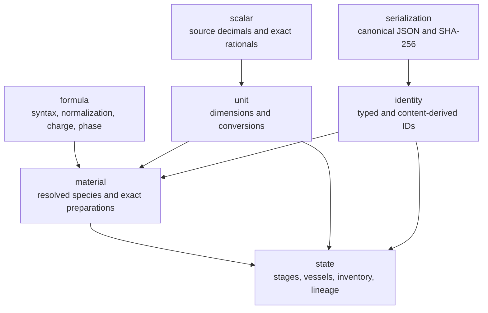

# `chem-domain`

> Rebaseline status: Slice 1 will replace quantity/material/vessel state with
> the definitive structural atom, electron, graph, mapping, operation, artifact,
> and frame domain. Existing code is temporary internal implementation, not a
> supported language contract.

`chem-domain` is the pure, deterministic value layer shared by later `.chems`
compiler slices. It contains no source parser, empirical catalogue, proof
search, application, networking, or rendering code.

Its Serde forms are nested domain representations, not independently versioned
interchange envelopes. The future source-AST, HIR, catalogue, and validated
artifact envelopes carry their applicable schema versions and govern the
domain values they contain.

## Module map

The arrows show where lower-level domain concepts are composed into richer
values. All public modules remain deterministic and independent of parsing,
catalogue policy, and procedure execution.

## Exact numeric contract

- `SourceDecimal` retains the original lexeme, integer coefficient, decimal
  scale, decimal places, written digits, and optional significant-digit count.
- `ExactScalar` is a reduced arbitrary-precision rational. JSON encodes it as
  `{ "numerator": "...", "denominator": "..." }`; both members are decimal
  strings and the denominator is positive and nonzero.
- No chemistry value is parsed through or serialized as `f32`/`f64`.

## Units and temperatures

`UnitSymbol` is the specification's closed 23-symbol registry. Resolving a
`UnitExpression` produces an exact canonical factor and five-component
dimension vector. Unit expressions retain the grammar's product/divisor tree
and authored exponent spelling rather than a second, potentially inconsistent
free-text copy. Source equality can therefore distinguish equivalent forms such
as `mol/L`, `mol*L^-1`, and an explicitly written `mol^+1`. Every multiplicative
quantity records the exact per-unit alias/power expansion used to reach
canonical units, and target conversions return evidence for both conversion
legs. `%`, `K`, and `degC` are standalone-only. A
`TemperaturePoint` stores exact kelvin while retaining its source decimal and
scale; subtracting points produces the distinct multiplicative
`TemperatureDifference` type.

Quantity and temperature-point equality compare normalized semantic values.
Their `source_eq` methods additionally compare authored spelling and unit or
scale metadata.

## Formulae and identities

`FormulaSyntax` preserves nested groups and adduct segments. Normalization uses
an injected `ElementRegistry`, resolves symbols to atomic-number identities,
and accumulates arbitrary-precision positive counts in deterministic element
order. Charge is an exact arbitrary-precision integer and phase is the closed
`aqueous | solid | liquid | gas` model.

Content-derived IDs use SHA-256 of canonical JSON. Catalogue-declared fact and
substance IDs are separate typed values. Canonical JSON sorts object keys,
emits no insignificant whitespace, and rejects every floating-point JSON
number.

## Verification

The fixed conformance inputs and canonical expected domain outputs live under
`conformance/quantities-types`, `conformance/formula-species`, and
`conformance/artifacts`. Integration tests execute the public API and compare
canonical result bytes with those checked-in goldens. Deterministic
generated-case tests cover unit conversion round trips and grouped-formula
expansion.
