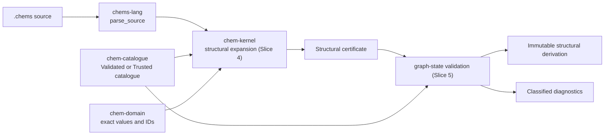

# `chem-kernel`

`chem-kernel` owns deterministic structural elaboration and, in Slice 5, the
trusted graph-state validation boundary. There is no discarded quantitative
compatibility path.

Slice 4 resolves complete `chems 1` source, an immutable catalogue, and one
strict external evidence packet into typed, unexecuted structural HIR. It
checks catalogue/version selection, structures, coefficients, equation terms,
rule roles and patterns, applicability, model disclosures, observation claims,
and evidence compatibility before expanding instances, atom maps, and reviewed
operation templates.

## Trusted pipeline

`expand_review_candidate` exists for conformance and chemistry review. Its HIR
is visibly marked untrusted. `expand_trusted` requires `TrustedCatalogue` and
returns an unforgeable `TrustedExpandedStructuralReaction`; Slice 5 consumes
that capability rather than trusting a mutable flag.

Both paths validate evidence packets. Runtime research is always retained as
`external_untrusted`; it cannot self-assert chemistry authority. The HIR keeps
exact source spans and per-derived-value catalogue premises. It exposes a
declaration-order-invariant semantic certificate plus a separate physical
provenance report, and labels expansion explicitly `unexecuted`. No Slice 4
API executes a graph operation or constructs a validated reaction.

Failures retain a stable class and `CHEMS-X...` code:

- `InvalidSource` for malformed or contradictory authored/evidence input;
- `UnsupportedChemistry` for identities or rule applicability outside the
  closed catalogue; and
- `CorruptTrustedData` for impossible post-catalogue structural failures.
