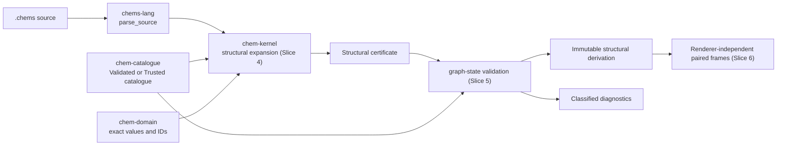

# `chem-kernel`

`chem-kernel` owns deterministic structural elaboration and the trusted
graph-state validation boundary. There is no discarded quantitative
compatibility path.

Slice 4 resolves complete `chems 1` source, an immutable catalogue, and one
strict external evidence packet into typed, unexecuted structural HIR. It
checks catalogue/version selection, structures, coefficients, equation terms,
rule roles and patterns, applicability, model disclosures, observation claims,
and evidence compatibility before expanding instances, atom maps, and reviewed
operation templates.

## Trusted pipeline

`expand_review_candidate` exists for conformance and chemistry review. Its HIR
is visibly marked untrusted. `expand_trusted` requires `TrustedCatalogue` and
returns an unforgeable `TrustedExpandedStructuralReaction`; Slice 5 consumes
that capability rather than trusting a mutable flag.

Both paths validate evidence packets. Runtime research is always retained as
`external_untrusted`; it cannot self-assert chemistry authority. The HIR keeps
exact source spans and per-derived-value catalogue premises. It exposes a
declaration-order-invariant semantic certificate plus a separate physical
provenance report, and labels expansion explicitly `unexecuted`. No Slice 4
API executes a graph operation or constructs a validated reaction.

## Structural validation

Slice 5 consumes expanded operations in their immutable ordinal sequence. For
every transition it checks the immediately preceding endpoint/bond/domain
state, reconstructs a validated `StructuralGraph`, checks reviewed valence and
formal-charge facts, and proves atom-count, explicit-electron, and closed-system
charge conservation. The final mapped atoms, covalent edges, ionic components,
metallic domains, and product assignments must exactly equal the declared
product graphs.

`validate_review_candidate` produces a derivation whose serialized trust is
explicitly `review_candidate`; it cannot construct trusted chemistry.
`validate_trusted` accepts only the unforgeable trusted expansion and
host-reviewed `TrustedCatalogue`, and is the sole constructor of
`ValidatedStructuralReaction`. The derivation records source, expansion, and
catalogue identities and rejects stale reuse.

## Structural frames

Slice 6 projects only a current `ValidatedStructuralReaction` into immutable
`SimulationFrame` values. Every frame retains exact atoms and electron labels,
distinct covalent/ionic/metallic relationships, product membership, typed
active-operation data, model disclosure, observation status, and source,
expansion, catalogue, derivation, and state digests. Presentation timing and
layout are absent from the chemistry artifact.

Frame generation rechecks byte-level source identity, semantic source and
expansion identity, external-evidence identity, and catalogue identity.
Observation records separately retain `external_untrusted` evidence trust even
inside a structurally trusted frame artifact. Review-candidate projection
exists only inside kernel tests for independent chemistry review and remains
visibly `review_candidate`; the public frame API requires the unforgeable
trusted validation capability.

Failures retain a stable class and `CHEMS-X...` code:

- `InvalidSource` for malformed or contradictory authored/evidence input;
- `UnsupportedChemistry` for identities or rule applicability outside the
  closed catalogue; and
- `CorruptTrustedData` for impossible post-catalogue structural failures.
