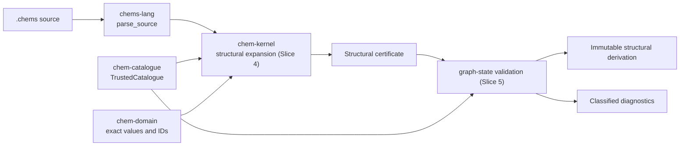

# `chem-kernel`

> Rebaseline status: the discarded quantitative kernel is no longer compiled.
> Structural Slices 4 and 5 repopulate this crate with deterministic expansion
> and graph-state validation; there is no compatibility path.

`chem-kernel` is reserved for trusted structural expansion, immutable graph
derivation, and validated artifacts. During Slice 2 it is an explicit empty
boundary; no old experiment or vessel API remains public.

## Trusted pipeline

Until those fixed slices land, source parsing stops at the typed frontend and
the workspace cannot claim structural expansion or validation.
