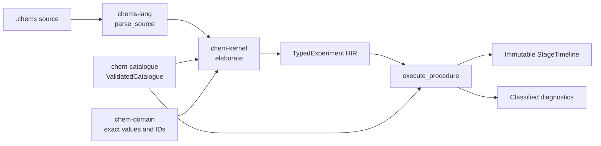

# `chem-kernel`

> Rebaseline status: Slices 4 and 5 will replace quantitative elaboration and
> vessel procedures with deterministic structural expansion and graph-state
> validation. Existing behavior is not a supported compatibility path.

`chem-kernel` owns trusted typed elaboration, exact experiment state, goals,
rules, derivations, and validated artifacts.

Slices 4 and 5 implement typed elaboration, initial materials, and deterministic
procedure execution. The public
`elaborate` entry point accepts source plus one validated catalogue and returns
either complete `TypedExperiment` HIR or source/semantic diagnostics.
`execute_procedure` accepts that HIR plus the exact bound catalogue and returns
an immutable `StageTimeline` or classified transition diagnostics.

## Trusted pipeline

Procedure execution requires the exact catalogue identity bound during
elaboration. Source or semantic errors prevent complete HIR, and invalid or
unsupported transitions prevent a complete timeline.

The implemented boundary includes:

- one shared experiment namespace with stable typed IDs;
- exact environment, quantity, unit, formula, species, medium, and operand
  resolution;
- every initial material constructor and prepared-component normalization;
- catalogue-fact and explicit-assumption premise tracing;
- warnings that do not suppress otherwise complete HIR;
- source origins for conditions, declarations, operations, and the experiment;
- a checked-in canonical HIR oracle and fixture-driven negative coverage.
- immutable vessel stages and exact elapsed time;
- linearly identified inventory portions and append-only lineage;
- all closed procedure operations with capacity, closure, partition, and
  direction checks;
- catalogue-scoped reaction opportunities without reaction inference;
- exact conservation and deterministic stage/portion/opportunity identities.

It does not infer reaction outcomes, elaborate claims, generate goals, run
tactics, or construct validated artifacts. Those boundaries begin in Slice 6
and later slices.
