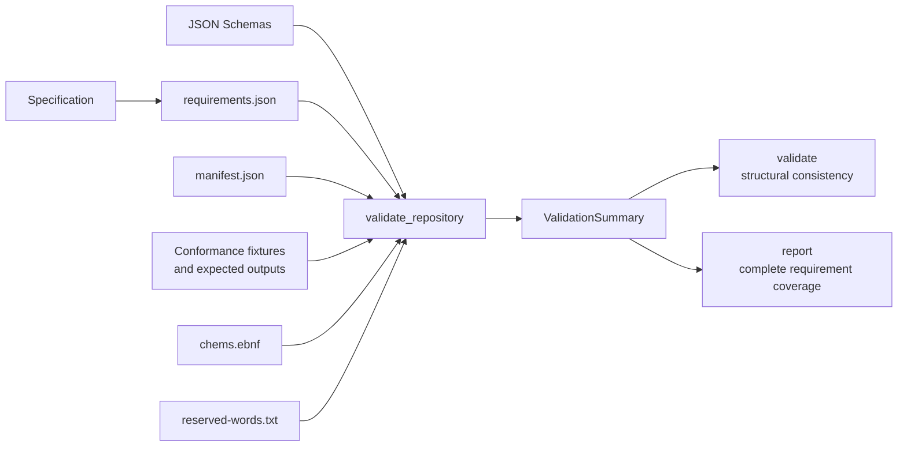

# `chems-conformance`

`chems-conformance` validates the repository-owned executable specification.
It connects normative requirements to manifest components and checked-in test
fixtures, and checks that the specification, grammar, reserved words, schemas,
and coverage metadata agree.

## Repository validation



The library exposes `validate_repository` plus canonical JSON and digest
helpers shared by fixture tests. The binary resolves the workspace root and
provides two commands:

```sh
cargo run -p chems-conformance -- validate
cargo run -p chems-conformance -- report
```

`validate` fails on inconsistent repository contracts. `report` additionally
fails when any declared component has no cases or does not cover all of its
assigned requirements.
