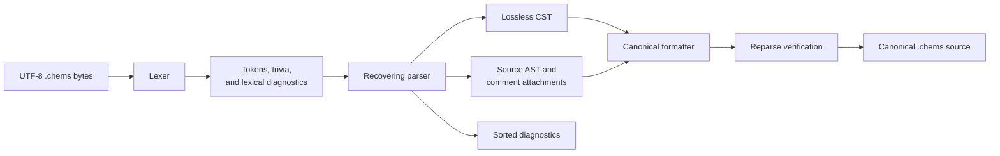

# `chems-lang`

> Rebaseline status: Slice 2 will migrate this frontend to the sole structural
> `chems 1` grammar. Existing quantitative parsing behavior is temporary
> internal implementation and has no compatibility status.

`chems-lang` is the lossless source frontend and canonical formatter for
`.chems`. It validates encoding and layout, tokenizes trivia and syntax,
builds a concrete syntax tree (CST), lowers a source AST, attaches comments,
and reports deterministic byte-span diagnostics with recovery.

## Frontend flow



`parse_source` and `parse_bytes` return the CST, AST, and diagnostics together.
`format_source` refuses incomplete input and reparses its output before
returning it. This crate does not resolve chemistry names, load catalogues, or
perform semantic validation; those are `chem-kernel` responsibilities.

## CLI

```sh
cargo run -p chems-lang -- parse experiment.chems
cargo run -p chems-lang -- format --check experiment.chems
cargo run -p chems-lang -- format --write experiment.chems
```
