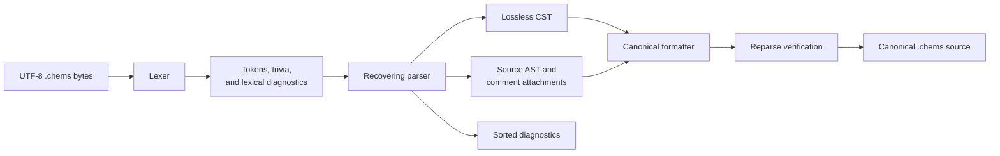

# `chems-lang`

> Structural Slice 2 status: implemented against the sole normative
> `chems 1` grammar. Discarded quantitative experiment syntax is accepted only
> as malformed negative input and has no compatibility path.

`chems-lang` is the lossless source frontend and canonical formatter for
`.chems`. It validates encoding and layout, tokenizes trivia and syntax,
builds a concrete syntax tree (CST), lowers a typed authored-reaction AST,
attaches comments, and reports deterministic byte-span diagnostics with
recovery and validated safe edits.

## Frontend flow



`parse_source` and `parse_bytes` return the CST, structural source AST, and
diagnostics together. `format_source` refuses incomplete input and reparses its
output before returning it. `apply_safe_edits` rejects overlapping,
out-of-bounds, or non-UTF-8-boundary edits before applying them. This crate
does not resolve chemistry names, load catalogues, apply reviewed rules, or
perform structural validation; those belong to later slices.

## CLI

```sh
cargo run -p chems-lang -- parse experiment.chems
cargo run -p chems-lang -- format --check experiment.chems
cargo run -p chems-lang -- format --write experiment.chems
```
